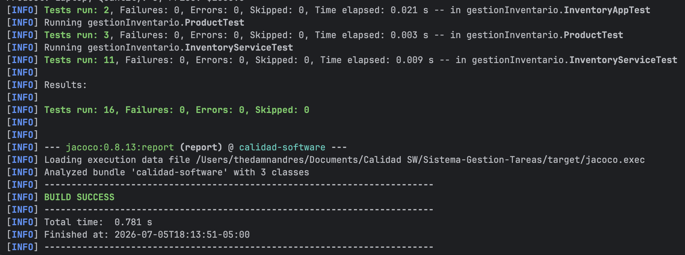
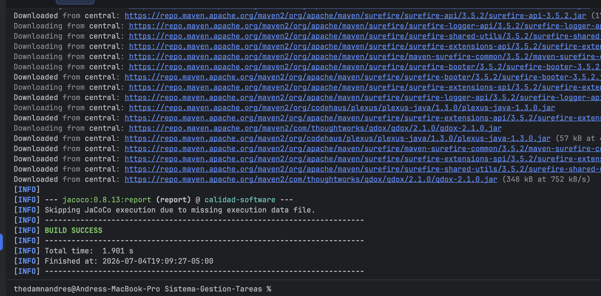
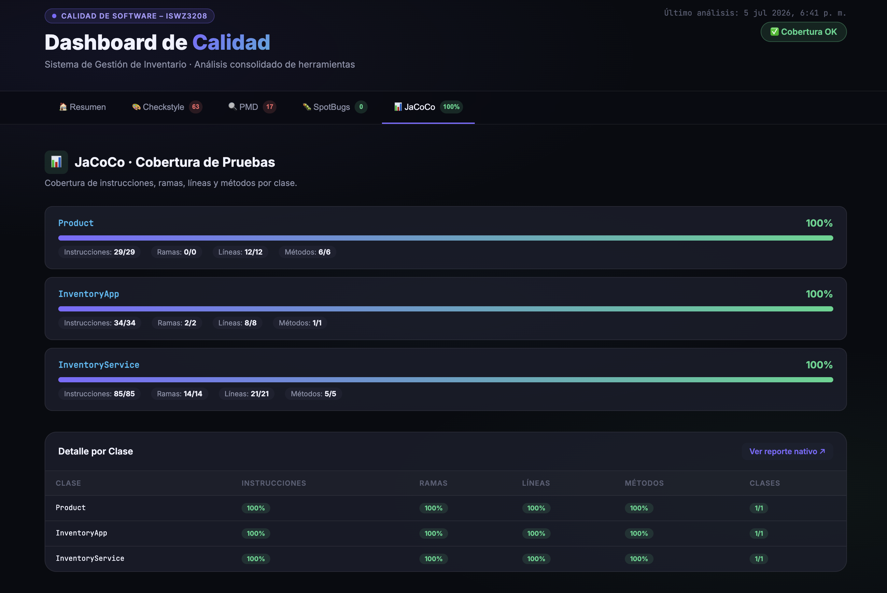
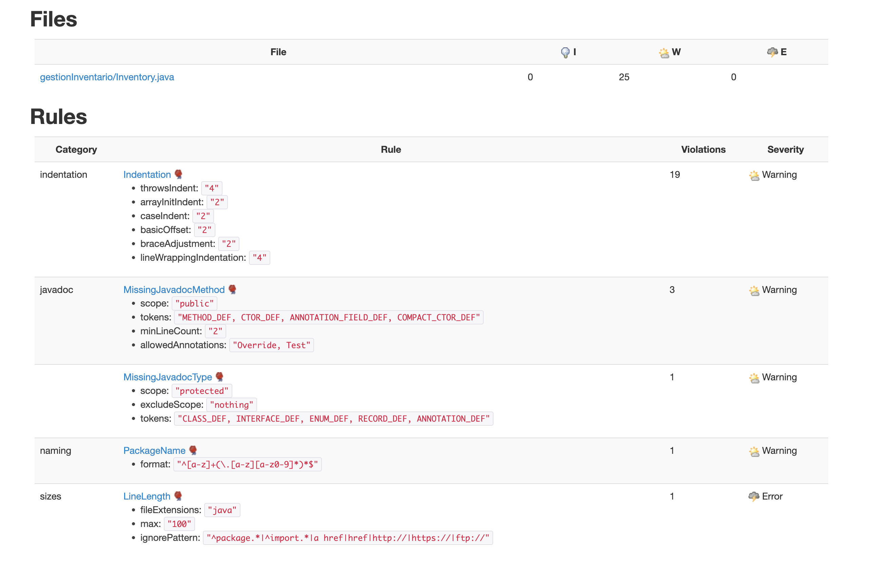
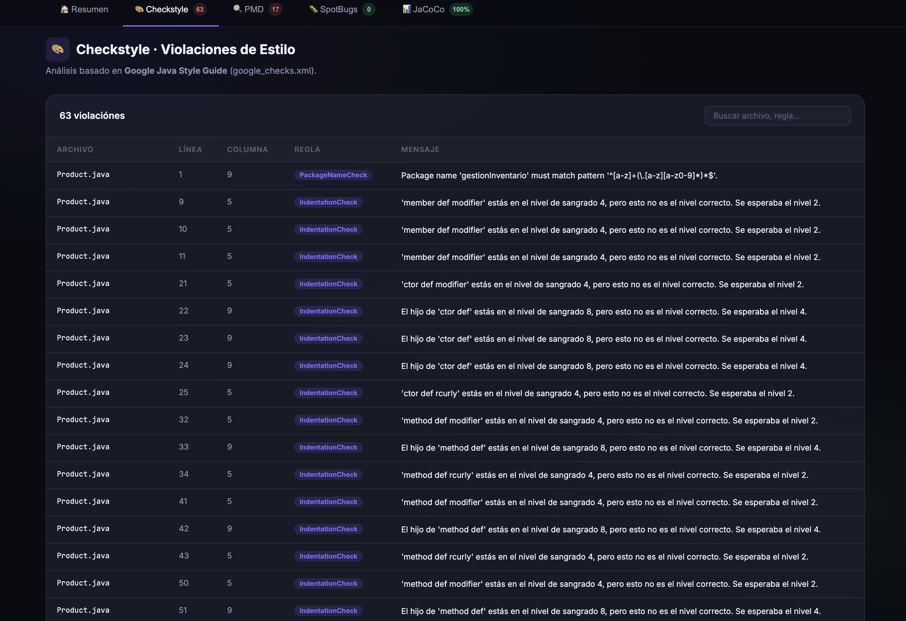
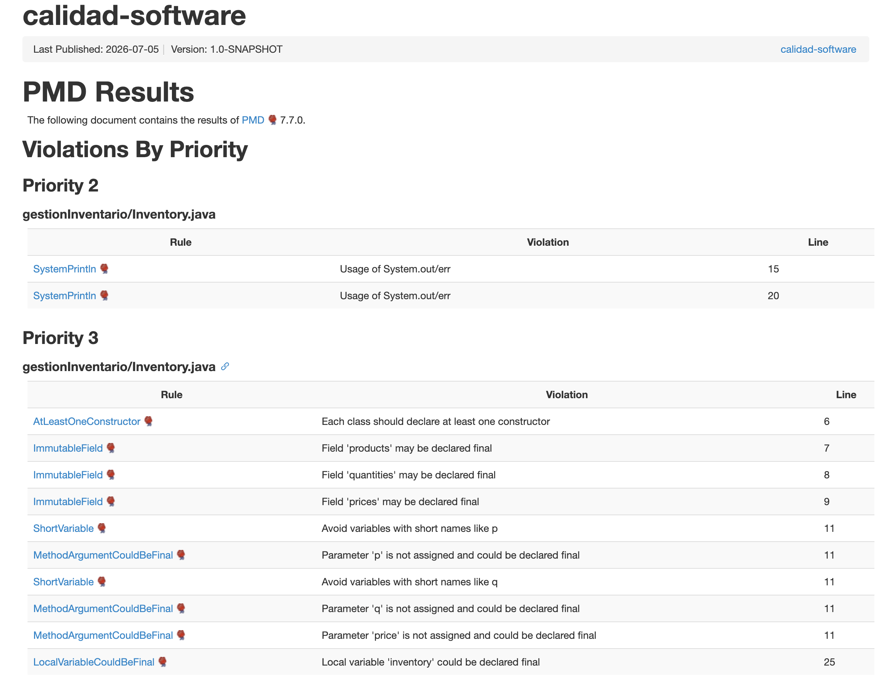
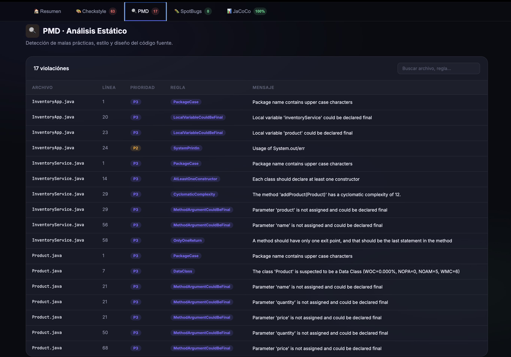
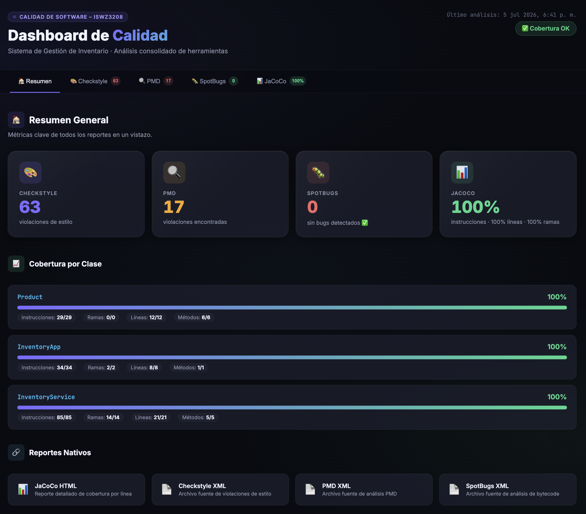

# Sistema de Gestión de Inventario · Calidad de Software

Trabajo práctico de **ISWZ3208 - Calidad de Software** · Universidad de las Américas (UDLA).

El proyecto parte de un código con problemas de calidad intencionales y aplica refactorización con **Clean Code**, principios **SOLID**, análisis estático y CI/CD, midiendo el impacto antes y después.

---

## Descripción del sistema

Aplicación Java para gestionar un inventario de productos. Permite agregar productos, actualizar cantidades, calcular el valor total del inventario y listar productos con bajo stock.

| Clase | Responsabilidad |
|---|---|
| `Product` | Modelo de datos: nombre, precio, cantidad |
| `InventoryService` | Lógica de negocio: agregar, actualizar, consultar inventario |
| `InventoryApp` | Punto de entrada: demo del sistema |

---

## Mejoras aplicadas

### Clean Code y SOLID

| Problema inicial | Solución aplicada |
|---|---|
| Listas paralelas (`products`, `quantities`, `prices`) por índice | Clase `Product` con encapsulamiento completo |
| Nombres poco descriptivos (`p`, `q`, `price`) | Nombres claros y descriptivos |
| Lógica mezclada con impresión en consola | Separación en `InventoryService` e `InventoryApp` |
| Sin manejo de errores | Validaciones: duplicados, cantidades negativas, nulos |
| Raw types (`List` sin genéricos) | `List<Product>` con tipos explícitos |
| Sin pruebas unitarias | 16 pruebas JUnit 5 con cobertura completa |

### Pruebas unitarias

16 pruebas · 0 fallos · 0 errores



### Cobertura de pruebas (JaCoCo)

| Clase | Instrucciones | Ramas | Líneas | Métodos |
|---|---|---|---|---|
| `Product` | **100%** | 100% | 100% | 100% |
| `InventoryService` | **100%** | 100% | 100% | 100% |
| `InventoryApp` | **100%** | 100% | 100% | 100% |

| Antes (0%) | Después (100%) |
|---|---|
|  |  |

### Análisis estático

| Herramienta | Antes | Después |
|---|---|---|
| Checkstyle |  |  |
| PMD |  |  |
| SpotBugs | Bugs de bytecode detectados | — 0 bugs detectados ✅ |

### Dashboard consolidado



---

## Ejecutar el proyecto

**Requisitos:** Java 21 · Maven 3.8+

```bash
# 1. Clonar el repositorio
git clone https://github.com/thedamnandres/Sistema-Gestion-Tareas.git
cd Sistema-Gestion-Tareas

# 2. Compilar y correr pruebas
mvn test

# 3. Análisis completo (pruebas + Checkstyle + PMD + SpotBugs + JaCoCo)
mvn verify

# 4. Ejecutar la aplicación
mvn exec:java -Dexec.mainClass="gestionInventario.InventoryApp"
```

## Ver el dashboard de calidad

```bash
# 1. Generar todos los reportes (desde la raíz del proyecto)
mvn clean verify spotbugs:spotbugs checkstyle:checkstyle pmd:pmd

# 2. Copiar reportes al dashboard
cp target/checkstyle-result.xml reports/
cp target/pmd.xml reports/
cp target/spotbugsXml.xml reports/spotbugs.xml
cp target/site/jacoco/jacoco.csv reports/
cp -r target/site/jacoco reports/jacoco

# 3. Levantar servidor local
cd reports && python3 -m http.server 8080
```

Abrir en el navegador: **http://localhost:8080**

> Todos los comandos deben ejecutarse desde la raíz del proyecto.

---

## Herramientas

- **Checkstyle** – estilo de código (Google Java Style Guide)
- **PMD** – detección de malas prácticas y diseño
- **SpotBugs** – análisis de bytecode
- **JaCoCo** – cobertura de pruebas
- **GitHub Actions** – CI/CD con pipeline paralelo (fan-out/fan-in)

---

## Equipo

| Integrante | Rol |
|---|---|
| Andres Jimenez | Líder del equipo |
| Galo Guevara | Análisis estático (Checkstyle / PMD / SpotBugs) · CI/CD |
| Paul Larrea | Métricas y cobertura (JaCoCo) |
| Pablo Criollo | Revisión manual (Clean Code / SOLID) |
| Roberto Guaña | Pruebas unitarias (JUnit 5) y validación de cobertura |
